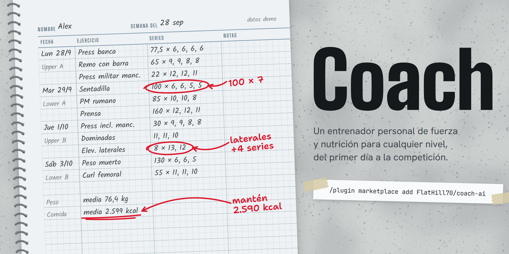
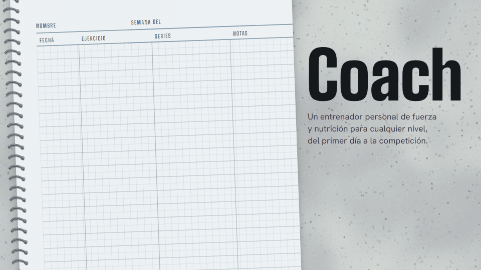
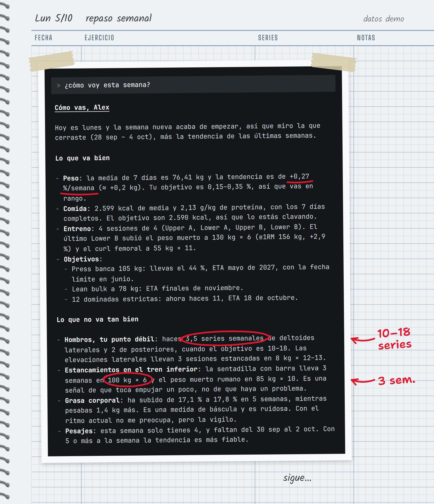
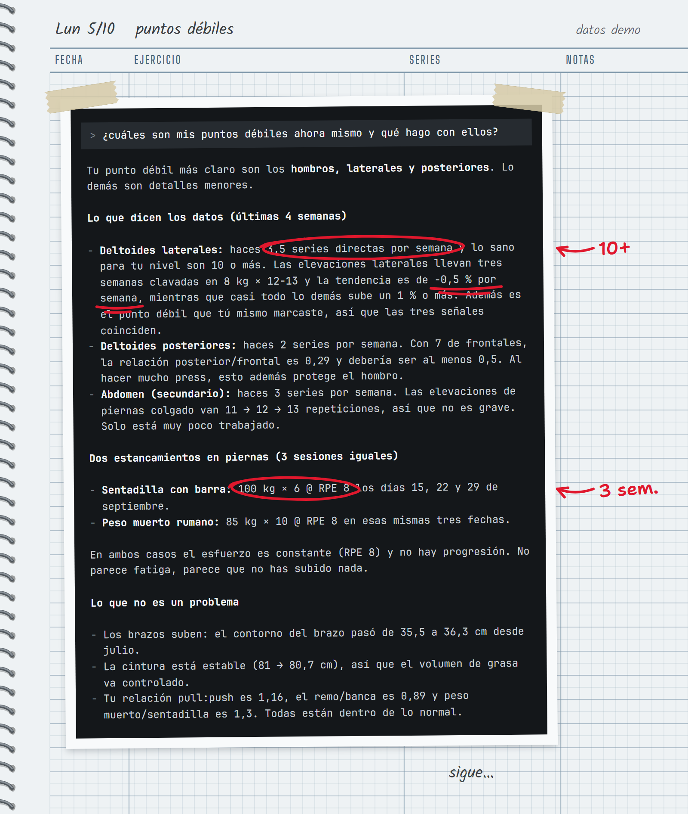
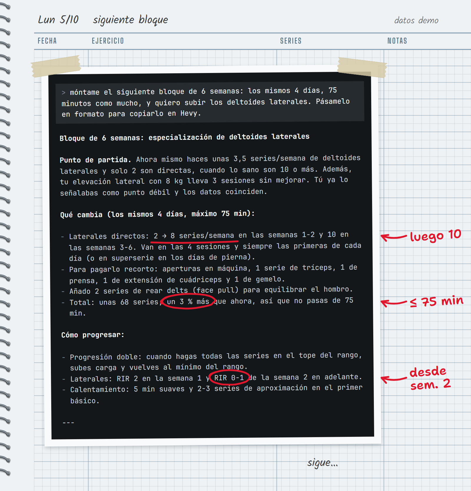
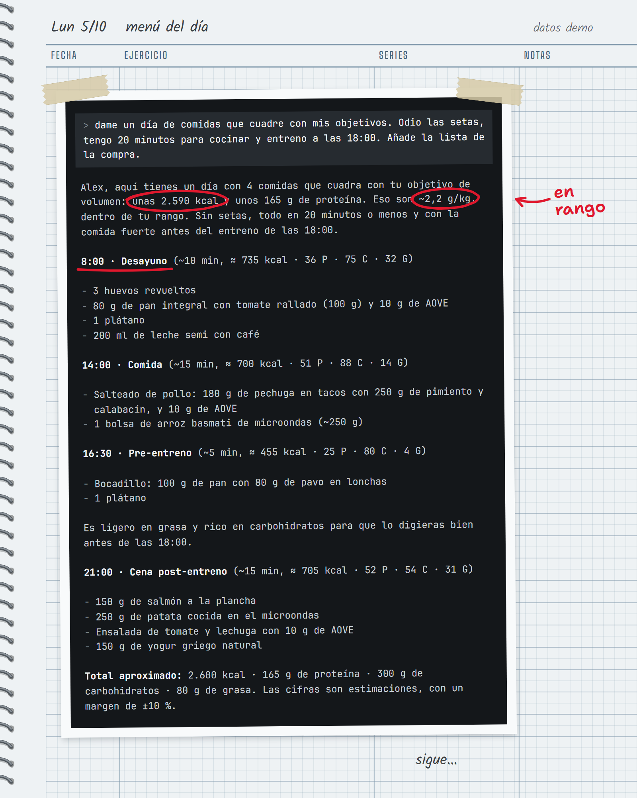
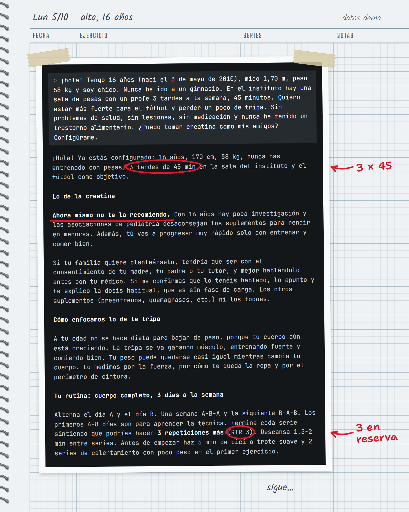
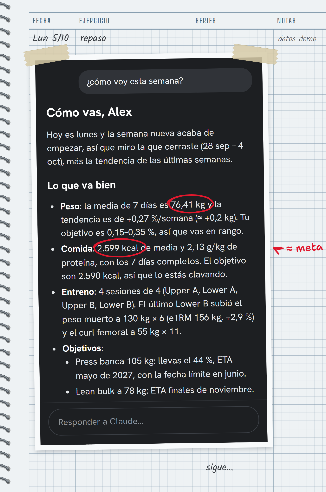
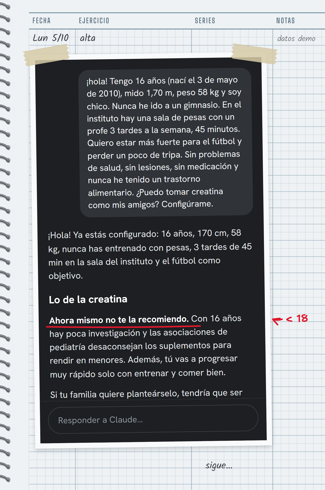

<p align="center">
  <picture>
    <source media="(prefers-color-scheme: dark)" srcset="docs/media/es/banner-dark.png">
    
  </picture>
</p>

<p align="center">
  <a href="https://github.com/FlatHill70/coach-ai/releases/latest"></a>
  <a href="https://github.com/FlatHill70/coach-ai/actions/workflows/ci.yml"></a>
  <a href="https://code.claude.com/docs/en/plugins"></a>
  <a href="https://nodejs.org"></a>
  <a href="README.md"></a>
  <a href="LICENSE"></a>
</p>

<p align="center"><a href="README.md">English</a> · <b>Español</b></p>

**Coach** es un entrenador personal de fuerza y nutrición que vive en [Claude Code](https://code.claude.com). Le cuentas quién eres una vez y te escribe la rutina, lee cada entreno que registras y detecta qué se ha estancado y qué músculos se están quedando atrás. También sigue tus objetivos con fechas estimadas reales y te fija unas calorías que se corrigen solas según la tendencia real de tu peso.

Sirve para **cualquiera**: alguien que nunca ha pisado un gimnasio, un chaval que empieza para rendir en el fútbol, quien persigue los 200 kg de peso muerto o un competidor preparando un campeonato. Cada recomendación se apoya en tus propios números, nunca en consejos genéricos.

<p align="center">
  
</p>

## Instalación

**Desde el marketplace de plugins de Claude Code** (recomendado, se actualiza solo):

```text
/plugin marketplace add FlatHill70/coach-ai
/plugin install coach@coach
```

Después activa las actualizaciones automáticas: `/plugin` › **Marketplaces** › **coach** › **Enable auto-update**. Empieza con `/coach` o diciendo sin más "planifícame la rutina".

<details>
<summary>Instalación manual (copia la skill en <code>~/.claude/skills/coach</code>)</summary>

macOS / Linux:

```bash
curl -fsSL https://raw.githubusercontent.com/FlatHill70/coach-ai/main/install.sh | bash
```

Windows (PowerShell):

```powershell
irm https://raw.githubusercontent.com/FlatHill70/coach-ai/main/install.ps1 | iex
```

Para actualizar, vuelve a ejecutar el mismo comando. Coach te avisa cuando sale una versión nueva. También puedes descargar `coach-skill.zip` de la [última release](https://github.com/FlatHill70/coach-ai/releases/latest) y descomprimirlo en `~/.claude/skills/` (crea la carpeta `coach`).

</details>

Requisitos: Claude Code y Node.js 20 o superior (22.13+ para leer exportaciones de Health Connect de Android).

## Qué hace

| Tú dices | Coach hace |
|---|---|
| "Configúrame" | Cribado de seguridad, tu nivel, objetivo, horario, material y preferencias de comida; después, tu primera rutina y tus objetivos de nutrición |
| "¿Cómo voy?" | Revisión semanal: tendencia de peso, comida, volumen por músculo, estancamientos, objetivos y **2–3 cambios concretos**, no diez consejos |
| "Planifícame el siguiente bloque" | Una rutina construida a partir de lo que haces de verdad, lista para copiar en Hevy o Strong |
| "¿Cuáles son mis puntos débiles?" | Detecta los músculos rezagados por volumen, tendencia de fuerza y ratios, y te monta un bloque de especialización |
| "Estoy estancado en banca" | Repasa la lista de causas (energía, recuperación, volumen, técnica, saltos de carga) antes de cambiar el ejercicio |
| "Menú para mañana, sin setas" | Comidas que cuadran con tus objetivos, con alternativas y lista de la compra |
| "Banca 60x8, 60x8, 57,5x7" · "Peso 72,4" | Lo apunta si no usas ninguna app |
| "Objetivo: 100 kg en banca para junio" | Comprueba que es realista para tu nivel y sigue el progreso con fecha estimada |

### Funcionando de verdad

Estas respuestas se grabaron con la skill funcionando sobre un conjunto de datos sintético de 12 semanas ("Alex"). Se le habló en español y no se ha reescrito nada: Coach responde en el idioma en el que le hables.

<table>
  <tr>
    <td width="50%"></td>
    <td width="50%"></td>
  </tr>
  <tr>
    <td><b>Revisión semanal.</b> Lo que va bien, lo que falla con sus números y tres cambios para la semana siguiente.</td>
    <td><b>Puntos débiles.</b> Solo cuando coinciden varias señales (volumen, tendencia, tu percepción) antes de especializar.</td>
  </tr>
</table>

<details>
<summary>Más: un bloque de 6 semanas, un menú, el primer plan de un adolescente y la vista en el móvil</summary>

<p></p>
<p></p>
<p></p>
<p align="center">
  
  
</p>

</details>

## Para cualquier nivel

| Nivel | Cómo se adapta Coach |
|---|---|
| **Nunca ha entrenado** | Palabras sencillas, una idea nueva por sesión, 2–3 sesiones de cuerpo completo con máquinas y mancuernas, un plan para el primer día en el gimnasio y versión en casa si el gimnasio echa para atrás |
| **Principiante** | Progresión lineal y doble en pocos ejercicios básicos, constancia ante todo, proteína |
| **Intermedio** | Volumen por grupo muscular, selección de ejercicios, puntos débiles, variación planificada |
| **Avanzado** | Bloques periodizados, especialización, gestión de fatiga y descargas |
| **Competidor** | Analista para ti y tu entrenador: distribución de intensidades, puesta a punto, elección de intentos a partir de tus e1RM recientes |

Objetivos: ganar músculo, perder grasa, recomposición, fuerza, salud general, resistencia/híbrido y rendimiento deportivo.

## La seguridad viene de serie

- **Primero, el cribado.** Un cuestionario tipo PAR-Q+ en el alta. Dolor en el pecho, desmayos o una restricción médica paran la programación hasta tener el visto bueno del médico. Las enfermedades crónicas, las lesiones y la medicación cambian lo que se prescribe.
- **Modo adolescente (13–17).** Rutina completa centrada en la técnica, sin tests de 1RM y sin series al fallo en los básicos pesados. **Nunca déficit calórico**: un objetivo de perder grasa se convierte en mantenimiento con buenos hábitos. Tampoco comentarios sobre el % de grasa. Creatina solo con 16–17 años y solo con el consentimiento de un tutor; estimulantes, nunca. Con menos de 13: deporte y peso corporal supervisado, no un plan de gimnasio.
- **Las protecciones están en el motor, no solo en el prompt.** El déficit tiene un tope del 25 % y hay suelos de calorías. No hay déficit con bajo peso, embarazo o antecedentes de TCA, y por encima de IMC 30 la proteína se calcula sobre un peso de referencia.
- **Señales de alarma** (dolor en el pecho, desmayo, dolor agudo o irradiado): siempre parar y acudir a un profesional.

Coach no es consejo médico ni diagnostica lesiones.

## Nutrición que se ajusta sola

1. **Objetivos** según tu meta: metabolismo basal (Mifflin-St Jeor, y Katch-McArdle si se conoce tu % de grasa), mantenimiento, calorías, proteína, grasa, hidratos, fibra y agua.
2. **Un bucle de ajuste.** Con unas dos semanas de comidas y pesadas, Coach estima tu mantenimiento *real* a partir de lo que comiste y de cómo se movió tu peso. Después ajusta las calorías cada 2 semanas o más según la tendencia, nunca por una pesada suelta.
3. **A tu manera.** Sin contar nada (platos y raciones), con estimaciones a partir de una descripción o una foto, o al gramo con tu app de comidas.
4. **Menús y listas de la compra** que respetan tu dieta (vegana, halal, kosher, sin gluten…), alergias, lo que no te gusta, presupuesto, tiempo para cocinar y cocina de tu país.

## Tus datos

Todo vive en `~/.coach/`, en tu ordenador: perfil, objetivos, diario, registros e importaciones. Las actualizaciones nunca tocan esa carpeta. El motor no envía tus datos a ninguna parte. Su única conexión de red es una comprobación diaria de nuevas versiones en GitHub, que se desactiva con `COACH_NO_UPDATE_CHECK=1`. Tus conversaciones con Claude pasan por Claude Code como siempre.

| Fuente | Cómo |
|---|---|
| **Chat** | "Banca 80x8, 80x8, 80x7", "peso 72,4", "he comido arroz con pollo" |
| **Hevy** / **Strong** | Exporta el CSV a una carpeta sincronizada (iCloud Drive, Google Drive…) y Coach importa el más reciente |
| **Hevy PRO** | Conecta `hevy-mcp` para leer los entrenos en directo y crear las rutinas directamente en la app |
| **Salud de Apple** | Un Atajo de iOS escribe peso, grasa, calorías y macros en iCloud cada vez que cierras la app de la báscula. Funciona con cualquier báscula o app de comidas que escriba en Salud |
| **Health Connect (Android)** | Exportación programada a Google Drive; Coach lee peso, grasa, pasos y nutrición |

Guías: [fuentes de datos](plugins/coach/skills/coach/references/data-sources.md) · [Atajo de iOS](plugins/coach/skills/coach/references/apple-shortcut.md) (en inglés). Si tu app registra ejercicios que no están en el catálogo, puedes añadirlos como **ejercicios propios** con sus grupos musculares ("añade mi ejercicio X").

## Actualizaciones y versiones

Las versiones se publican solas con [release-please](https://github.com/googleapis/release-please):

1. Cada cambio con mensaje `feat:` o `fix:` acaba en una PR de release.
2. Al fusionarla, se sube la versión, se actualiza el [changelog](CHANGELOG.md), se etiqueta la release y se adjuntan los zips.
3. Las instalaciones del marketplace la reciben automáticamente (con auto-update activado) o con `/plugin marketplace update coach`.
4. En las instalaciones manuales, Coach avisa con una línea y basta con volver a ejecutar el instalador.

## Desarrollo

```bash
npm test                                # tests del motor (Node 22+)
claude plugin validate .                # manifiestos
claude --plugin-dir ./plugins/coach     # probarlo en local
npm run demo                            # datos sintéticos en examples/demo/home
npm run media                           # regenerar banner, capturas y GIF
```

Consulta [CONTRIBUTING.md](CONTRIBUTING.md). ¿Falta un ejercicio? [Pídelo aquí](https://github.com/FlatHill70/coach-ai/issues/new?template=exercise.yml).

## Aviso

Coach da orientación general de entrenamiento y nutrición a partir de los datos que le proporcionas. No es médico, fisioterapeuta ni dietista-nutricionista, ni los sustituye. Consulta con un profesional antes de empezar si tienes alguna enfermedad, estás embarazada o eres menor de edad, y para en cuanto algo te duela.

## Licencia

[MIT](LICENSE)
