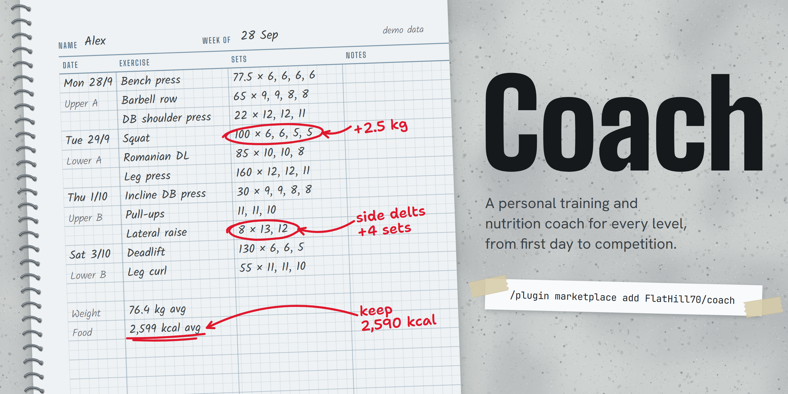
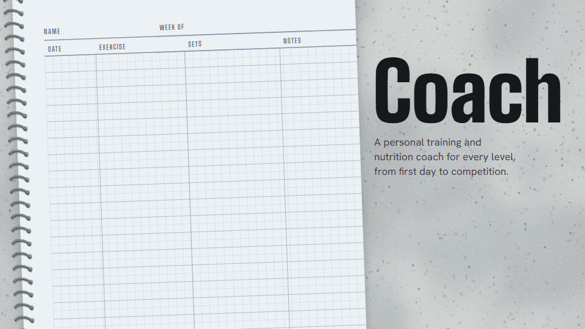
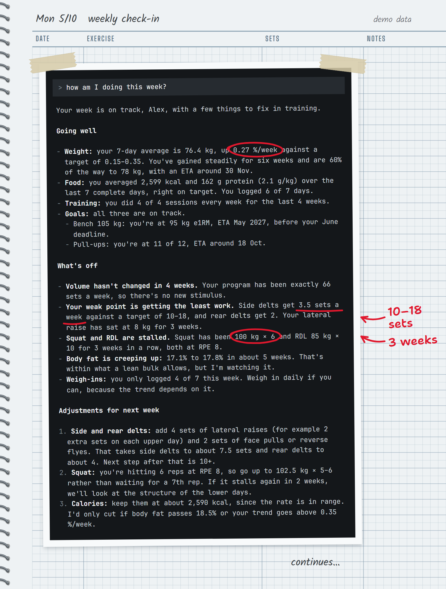
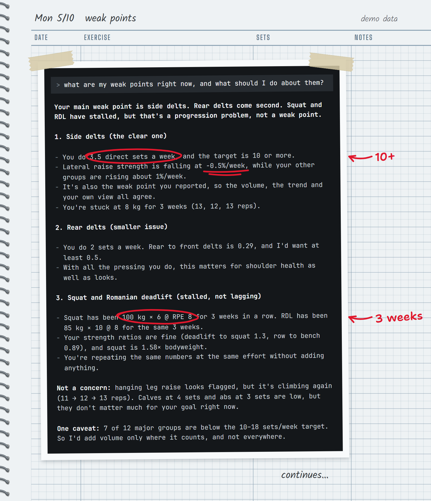
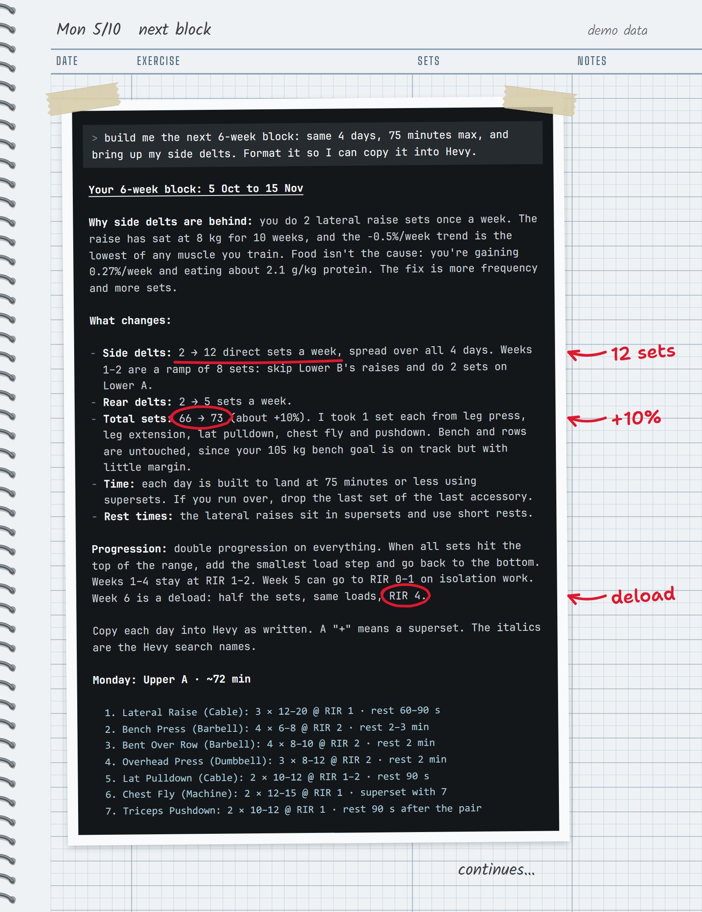
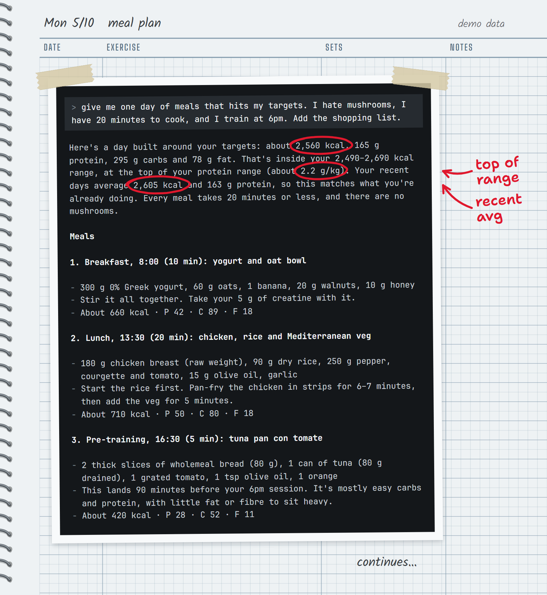
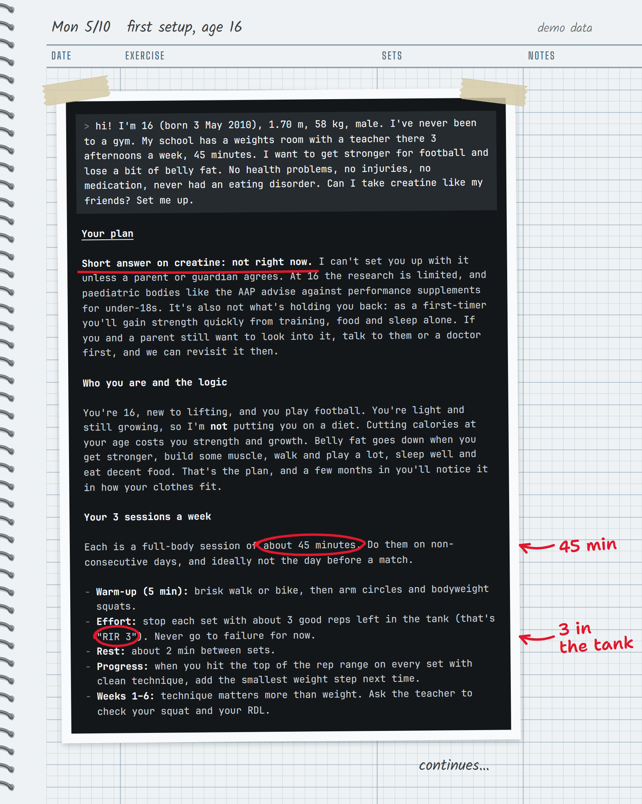
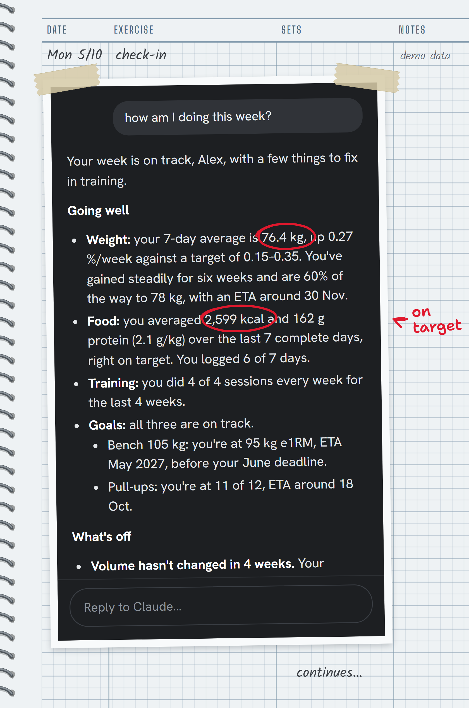
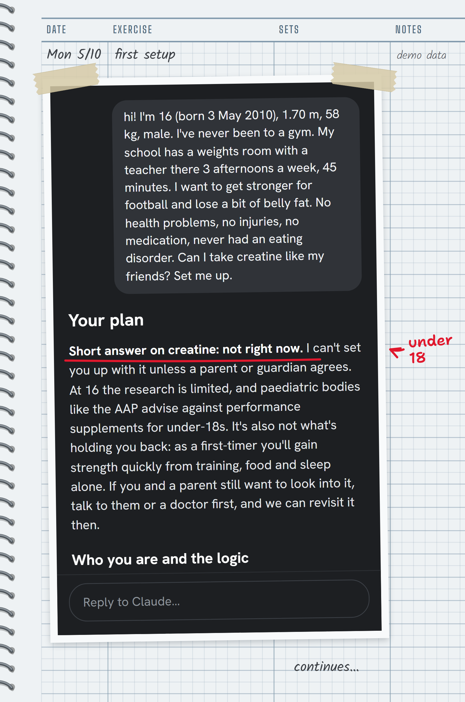

<p align="center">
  <picture>
    <source media="(prefers-color-scheme: dark)" srcset="docs/media/banner-dark.png">
    
  </picture>
</p>

<p align="center">
  <a href="https://github.com/FlatHill70/coach-ai/releases/latest"></a>
  <a href="https://github.com/FlatHill70/coach-ai/actions/workflows/ci.yml"></a>
  <a href="https://code.claude.com/docs/en/plugins"></a>
  
  
  <a href="LICENSE"></a>
</p>

<p align="center"><b>English</b> · <a href="README.es.md">Español</a></p>

**Coach** is a personal strength and nutrition coach that lives in [Claude Code](https://code.claude.com). Tell it about yourself once and it writes your program, reads every workout you log, spots what's stalling and which muscles are falling behind, tracks your goals with real ETAs and sets calorie targets that correct themselves from your actual weight trend.

It works for **anyone**: someone who has never set foot in a gym, a teenager starting out for football, a lifter chasing a 200 kg deadlift or a competitor peaking for a meet. Every recommendation cites your own numbers, never generic tips.

<p align="center">
  
</p>

## Install

**From the Claude Code plugin marketplace** (recommended, updates itself):

```text
/plugin marketplace add FlatHill70/coach-ai
/plugin install coach@coach
```

Then turn on automatic updates: `/plugin` › **Marketplaces** › **coach** › **Enable auto-update**. Start talking with `/coach` or just say "plan my routine".

<details>
<summary>Manual install (copies the skill into <code>~/.claude/skills/coach-ai</code>)</summary>

macOS / Linux:

```bash
curl -fsSL https://raw.githubusercontent.com/FlatHill70/coach-ai/main/install.sh | bash
```

Windows (PowerShell):

```powershell
irm https://raw.githubusercontent.com/FlatHill70/coach-ai/main/install.ps1 | iex
```

Run the same command again to update. Coach tells you when a new release is out. You can also download `coach-skill.zip` from the [latest release](https://github.com/FlatHill70/coach-ai/releases/latest) and unzip it into `~/.claude/skills/coach-ai/`.

</details>

Requirements: Claude Code and Node.js 20 or newer (22.13+ to read Android Health Connect exports).

## What it does

| You say | Coach does |
|---|---|
| "Set me up" | Safety screening, your level, goal, schedule, equipment and food preferences, then your first program and nutrition targets |
| "How am I doing?" | Weekly check-in: weight trend, food, volume per muscle, stalls, goals, and **2–3 concrete changes**, not ten tips |
| "Plan my next block" | A program built from what you actually do now, formatted to copy into Hevy or Strong |
| "What are my weak points?" | Finds lagging muscles from volume, strength trends and ratios, then writes a specialisation block |
| "I'm stuck on bench" | Runs the stall checklist (energy, recovery, volume, technique, load jumps) before touching the exercise |
| "Meal plan for tomorrow, no mushrooms" | Meals that hit your targets, with swaps and a shopping list |
| "Bench 60x8, 60x8, 57.5x7" · "I weighed 72.4" | Logs it when you don't use an app |
| "Set a goal: 100 kg bench by June" | Checks it's realistic for your level, then tracks progress and ETA |

### See it on real output

These replies were recorded from the skill running on a synthetic 12-week demo dataset ("Alex"). Nothing was rewritten.

<table>
  <tr>
    <td width="50%"></td>
    <td width="50%"></td>
  </tr>
  <tr>
    <td><b>Weekly check-in.</b> What's going well, what's off with the numbers, and three changes for next week.</td>
    <td><b>Weak points.</b> Signals that agree (volume, trend, your own perception) before any specialisation.</td>
  </tr>
</table>

<details>
<summary>More: a 6-week program, a meal plan, a teenager's first plan, and the phone view</summary>

<p></p>
<p></p>
<p></p>
<p align="center">
  
  
</p>

</details>

## Built for every level

| Level | How Coach adapts |
|---|---|
| **Never trained** | Plain words, one new idea per session, 2–3 full-body sessions with machines and dumbbells, a plan for the first gym visit, a home version if the gym is a barrier |
| **Beginner** | Linear and double progression on a few basics, consistency first, protein |
| **Intermediate** | Volume per muscle group, exercise selection, weak points, planned variation |
| **Advanced** | Periodised blocks, specialisation, fatigue and deload management |
| **Competitor** | Analyst for you and your coach: intensity distribution, peaking, attempt selection from recent e1RMs |

Goals covered: muscle gain, fat loss, recomposition, strength, general health, endurance/hybrid and sport performance.

## Safety is built in

- **Screening first.** A PAR-Q+ style questionnaire at onboarding. Chest pain, fainting or a doctor's restriction stops programming until there is medical clearance. Chronic conditions, injuries and medication change what gets prescribed.
- **Teen mode (13–17).** A full program, focused on technique, with no 1RM testing and no sets to failure on heavy lifts. **No calorie deficits** (a fat-loss goal becomes maintenance with healthy habits) and no comments on body fat. Creatine only at 16–17, only with a guardian's consent; never stimulants. Under 13: sport and supervised bodyweight training, not a gym plan.
- **Guards in the engine, not just in the prompt.** Deficits are capped at 25%, calorie floors apply, there's no deficit when underweight, pregnant or with an eating-disorder history, and protein uses a reference weight above BMI 30.
- **Red flags** (chest pain, fainting, sharp or radiating pain) always mean stop and see a professional.

Coach is not medical advice and doesn't diagnose injuries.

## Nutrition that adjusts itself

1. **Targets** for your goal: BMR (Mifflin-St Jeor, plus Katch-McArdle when body fat is known), maintenance, calories, protein, fat, carbs, fibre and water.
2. **A feedback loop.** Once you have about two weeks of food and weigh-ins, Coach estimates your *real* maintenance from what you ate and how your weight moved, then adjusts calories every 2+ weeks from the trend, never from one weigh-in.
3. **Your way of eating.** Count nothing (plates and portions), log rough estimates from a description or photo, or track to the gram through your food app.
4. **Meal plans and shopping lists** that respect diet (vegan, halal, kosher, gluten-free…), allergies, dislikes, budget, cooking time and cuisine.

## Your data

Everything lives in `~/.coach/` on your computer: profile, goals, journal, logs and imports. Updates never touch that folder. The engine sends none of your data anywhere; its only network call is a once-a-day check for new releases on GitHub (turn it off with `COACH_NO_UPDATE_CHECK=1`). Your conversations with Claude go through Claude Code as usual.

| Source | How |
|---|---|
| **Chat** | "Bench 80x8, 80x8, 80x7", "I weighed 72.4", "lunch was chicken and rice" |
| **Hevy** / **Strong** | Export the CSV into a synced folder (iCloud Drive, Google Drive…); Coach imports the newest |
| **Hevy PRO** | Connect `hevy-mcp` to read workouts live and create routines straight in the app |
| **Apple Health** | An iOS Shortcut writes weight, body fat, calories and macros to iCloud whenever your scale app closes. Works with any scale or food app that writes to Health |
| **Android Health Connect** | Scheduled export to Google Drive; Coach reads weight, body fat, steps and nutrition |

Setup guides: [data sources](plugins/coach/skills/coach/references/data-sources.md) · [iOS Shortcut](plugins/coach/skills/coach/references/apple-shortcut.md). Exercises your app logs that aren't in the catalogue can be added as **custom exercises** with their muscle groups ("add my exercise X").

## Updates and releases

Releases are automated with [release-please](https://github.com/googleapis/release-please). Every merged change with a `feat:` or `fix:` message ends up in a release PR. Merging it bumps the version, updates the [changelog](CHANGELOG.md), tags the release and attaches the zips. Marketplace installs pick it up automatically (with auto-update on) or with `/plugin marketplace update coach`. Manual installs get a one-line notice from Coach and re-run the installer.

## Development

```bash
npm test                                # engine tests (Node 22+)
claude plugin validate .                # manifests
claude --plugin-dir ./plugins/coach     # try it locally
npm run demo                            # synthetic dataset in examples/demo/home
npm run media                           # re-render banner, screenshots and GIF
```

See [CONTRIBUTING.md](CONTRIBUTING.md). Missing an exercise? [Open an exercise request](https://github.com/FlatHill70/coach-ai/issues/new?template=exercise.yml).

## Disclaimer

Coach gives general training and nutrition guidance based on the data you provide. It is not a doctor, physiotherapist or dietitian, and it is not a substitute for one. Check with a professional before starting if you have a medical condition, are pregnant, or are under 18, and stop immediately if something hurts.

## License

[MIT](LICENSE)
